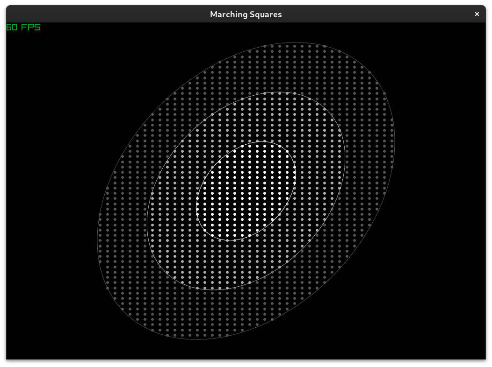

Marching Squares
================

Building/Running
----------------
Run with `odin run .` from the project root directory, or use whichever build/run technique you prefer.

Controls
--------
Press Space to toggle visibility of grid points.  
You can also press P to pause, but that doesn't really serve any purpose beyond me fiddling with my game/sim development techniques.

